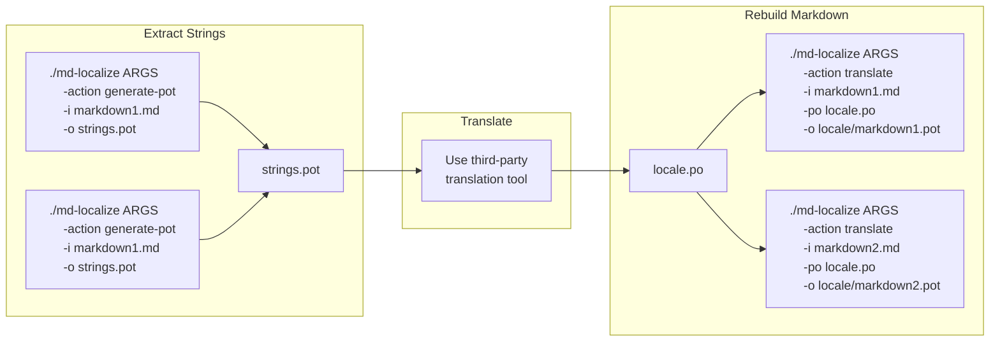

# Markdown Localize

This tool was designed to be used in combination with an third-party localization tool that supports .pot/.po (gettext) files.
The process encompasses three stages:

1. Extract Strings
1. Translate
1. Rebuild Markdown

The diagram below shows the process when using this tool:



## Extract Strings

This is the first stage and it is where source files are scanned to extract strings to be translated.

The following command line should be used:

```bash
./md-localize --action generate-pot --input path/to/markdown.md --output path/to/strings.pot
```

The output file used here will be needed in the next stage.

If you have multiple source Markdown files, it is you decision to combine them into a single .pot file, or multiple .pot files.
You can group sets of source Markdown files into a specific .pot file, and another group of source Markdown files into a different .pot file.

The example below shows the commands to groups source Markdown files into group A and group B.
Each group generates its respective .pot file: `strings-A.pot` and `strings-B.pot`.

It is important that the commands for each group are ran in sequence, and not in parallel.
When the first command of a group is executed, and if the output .pot file does not exist it is created.
When the following commands of the same group are executed, the .pot file exists and extracted strings are appended to the file.

```bash
./md-localize --action generate-pot --input path/to/markdown-A1.md --output path/to/strings-A.pot
./md-localize --action generate-pot --input path/to/markdown-A2.md --output path/to/strings-A.pot
./md-localize --action generate-pot --input path/to/markdown-A3.md --output path/to/strings-A.pot

./md-localize --action generate-pot --input path/to/markdown-B1.md --output path/to/strings-B.pot
./md-localize --action generate-pot --input path/to/markdown-B2.md --output path/to/strings-B.pot
```

## Translate

The translation stage is where you should use a third-party tool.
This thrid-party tool should take as input the .pot file(s) generated in the previous stage, and as result produce a .po file for each locale that you are translating into.

## Rebuild Markdown

The final stage is to take the source Markdown files, and the .po files generated by the translation tool in the previous stage, and with those rebuild the translated Markdown.

In this step, the input markdown is scanned, and each string found is replaced by the translation that is defined in the .po file.
As a result the `markdown.locale.md` file is created.

The simplest command is as follows:

```bash
./md-localize --action translate --input path/to/markdown.md --po path/to/strings.locale.po --output path/to/markdown.locale.md
```

The command above should be executed for each source Markdown file.
If you used multiple .pot files in the Extract Strings stage, you need to specify the corresponding .po file each time you execute this command.

---

## Command Line arguments

### --action <OPTION>, -a <OPTION>

Valid options are: `generate-pot` and `translate`

### --input <FILE>, -i <FILE>

Input file or directory.
If a directory is specified, the command is recursively applied to all *.md files inside the directory or sub-directories.

### --output <FILE>, -o <FILE>

The file to write the output to.
If not specified, the output is written to console.

### --po-file <FILE>, -po <FILE>

The translated .po file.
This is only used when the `translate` option is used.

### --po-dir <DIRECTORY>, -pod <DIRECTORY>

The directory to place the .pot files.
Using this option will re-create the directory structure existing in the `--input` and one .pot file for each.
This is only used when the `generate` option is used.
When using this option, do **not** the `--po-file` option.

### --gfm-task-lists

Enable task lists as defined in [Task list items (extension)](https://github.github.com/gfm/#task-list-items-extension-).

### --gfm-tables

Enable tables as defined in [Tables (extension)](https://github.github.com/gfm/#tables-extension-).

### --gfm-front-matter

Parse and scan YAML front-matter (if it exists).

### --gfm-front-matter-exclude <KEY>

Specify a key to be ignored, and hence its value is not extracted for translation.
If you need to specify multiple keys, repeat this argument.

### --ignore-image-alt

By default, image's alternative text is extracted.
Use this option to ignore it.

### --definition-lists

Enable parsing of definition lists
See [Definition lists](https://github.com/xoofx/markdig/blob/master/src/Markdig.Tests/Specs/DefinitionListSpecs.md#definition-lists) for more info.

### --custom-attributes

Enable custom attributes to be parsed.
See [Generic Attributes](https://github.com/xoofx/markdig/blob/master/src/Markdig.Tests/Specs/GenericAttributesSpecs.md) for more info.

### --ignore-pattern <REGEX>

This allows you to ignore specific patterns from being extracted.
For example, if you want to ignore HTML comments inside a Markdown file you can use: `--ignore-pattern '<!--.*-->'`.

### --include-only-pattern <PATTERN>

This allows to restrict to patterns matching this regex.

### --parse-html

Enable HTML parsing.
When enabled, if HTML blocks are found, the are parsed, and text strings are extracted for translation.
If disabled, the resulting text string will include the HTML code.

### --min-ratio N

Only write translated Markdown file if translation ratio is above.
Value is integer from 0 to 100.
This argument is only used when `--action` is set to `translate`.

If you want to generate the translated Markdown only if all strings are translated you can use `--min-ratio 100`.

### --markdown-translator-comment <STRING>

Add extra comments to markdown strings only.
Strings extracted from front-matter or HTML (when options enabled) do not get the comment added to the .pot entry.
Only valid with `generate-pot` action.

### --locale <STRING>, -l <STRING>

A locale code.
Examples: pt-BR, ja-JP

### --update-image-relative-paths

Flag to enable updating relative paths to images to point to the original image.
Only used when `translate` action is specified.

### --update-links-relative-paths

Flag to enable updating relative paths to other files (not images) to point to the original file.
Only used when `translate` action is specified.

### --add-front-matter-source <KEY>

Add '<KEY>' to front-matter with the relative path to the source markdown file.
Only relevant when the action is set to `translate`.

### --update-front-matter-locale

If a 'locale' key exists in front-matter, update it to the locale being translated.

### --add-front-matter-key KEY:VALUE

Add the specified `KEY` with value `VALUE` to the front-matter of translated markdown files.
Usage of this option may override other options such as `--add-front-matter-source` and `--update-front-matter-locale`.
If the original markdown does not have any front-matter, then this option won't have any effect.

### --file-suffix STRING

Optional suffix to append to the output file names.
This affects the files specified in `--output`, `--po-file` or `--po-dir`

### --append-pot

Only used whe `--action` is set to `generate-pot`.
If used, and output file exists, then the .pot file is updated.

### --ignore-missing-po

Ignore missing .po file.
This should be used with `--keep-source-strings`.

### --keep-literals-together

When multiple literals (e.g. hyperlink, text, emphasis) are part of the same markdown block (i.e. paragraph) keep them as a single string.
This results in a string containing markdown.
